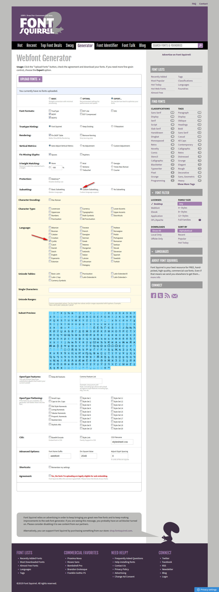
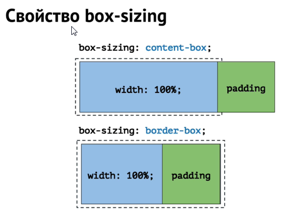
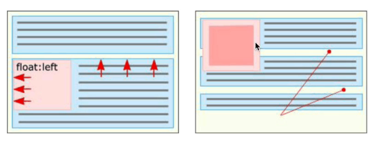
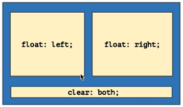

# [Навыки > ](../teach.md)CSS

## Советы:
* Старайтесь не использовать одновременно `width` и `height`, если это не декоративный элемент с фиксированными размерами.
* Старайтесь не задавать фиксированную высоту. 
    Если все-таки нужна высота, то лучше использовать `min-height`.
* Когда вы верстаете по сетке и размечаете блоки, лучше margin'ы и отступы между элементами создавать с помощью только `margin-bottom`. 
    Но для заголовков обычно задают `margin` сверху и снизу
* Не используйте `!important`. Если используйте, обоснуйте его необходимость.
* Не используйте вложенность больше двух уровней
* Указавайте альтернативные варианты шрифта и тип семейства, в конце перечисления `font-family`[(список безопасных шрифтов)](https://www.cssfontstack.com/)
    `font-family: "Основной шрифт", "Безопасный шрифт","Тип шрифта"`
    
     `font-family: 'PT Sans', 'Arial', sans-serif;`
* При использовании градиента, всегда  так же указывайте(для доступности старым браузерам) `backround-color`
* При наполнении контентом(как в макете) элементы каждой страницы 
соотвествуют макету, но допускаются: 
    * Различия в 5px по высоте(при расстояниях > 30px) и 2px по ширине
    * Отсутствие стилизации кастомных элементов форм
    * Различия в отображении шрифтов на различных платформах
* Для фоновой картинки прописывай фоновый цвет(который преобладает на фоновой картинке). Страница выклядит как макет, когда картинка еще не загружена либо есть пробле
    * для ретиновых экранов используй фон который в два раза больше(размера) обычного
* Верстка проходит тестирование на переполнение контентом:
    * Не ломается при добавлении в элементы большего кол-ва текста;
        `//можно использовать чтобы избавить блок от переполнения(вложенные эл-ты)
            .selector
                max-height 100px
                overflow-y auto
        `
    * Не ломается при использовании картинок с неподходящими размерами;
    * Не ломается при изменении кол-ва потоковых блоков
* margin/padding задания универсальных св-в:
Св-во| top | right | bottom | left | Коментарии
--- | --- | --- | --- | --- | ---
margin/padding | 2px | 30px | 400px | 5000px | все значения указаны
margin/padding | 2px | 30px | 400px | /* 30px */ | указаны только первые три значения, четвертое значение наследуется из второго
margin/padding | 2px | /*2px | 2px | 30px */ | указано только одно значение, оно наследуется во все остальные
* <details><summary>Процентные значения</summary>
    - ширина, заданная в процентах, считается относительно ширины содержащего блока
    - высота, заданная в процентах, считается относительно высоты содержащего блока, но только если она задана явно
    - margin-left/right и padding-left/right заданная в процентах считаются относительно содержащего блока
    - высота содержащего блока(если не задана) = сумма места, занимаемого его детьми
<details>

* Текст не выпадает из блоков, нижерасположенные блоки не скрываются смещение блоков в потоке сохраняет логику потока(не приводит к нарушению сетки)
* Для картинок(галереи, лого, и т.д.) задавайте фиксированные размеры. Защитит верстку от разваливания
* Если задаете фон для элемента, то тут же задавайте контрастный цвет для текста
* Не используй `outline none`. Это св-во необходимо чтобы можно было пользоваться сайтом с помощью клавиатуры

* <details><summary>**Скрываем элемент(одновременно оставить доступным)**</summary>
.selector 
    position absolute
    clip rect(0 0 0 0)
    width 0
    height 0

Что бы скрыть тект внутри ссылки можно обернуть текст в `span` и затем его скрыть
    `//pug
    a.social-btn(href='#')
        span Вконтакте
    //stylus
    social-btn span
        display none      
     `
<details>
  
* [Вы не знаете CSS](https://youtu.be/VoA-aQu75Xk)
    * em
    * i
<details>
    <summary>
        Использование внешних шрифтов
    </summary>
    
[Подключение нестандартных шрифтов.](https://fontstorage.com/blog/about-font-face-part-one/)[Часть 2.](https://fontstorage.com/blog/about-font-face-part-two/)
[Поиск шрифтов:](https://www.fontsquirrel.com/tools/webfont-generator)
    
</details>
* Что такое поток документа? Блочная модель документа

    **Поток документа** 
        Управлять потоком можно с помощью:
            - блочной модели(управляет размером модели и отступами между ними)
            - изменяют направление потока(`float, flexbox`)
            
<details>
<summary>Блочные элементы - <div>,<section>,<h1>...<h6>,<p>,<ul>,<ol></summary>
Особенности:
- Принудительный перенос строки
- Воспринимают ширину, высоту, внутрение и внешние отступы.
- Занимают все достпуное по ширине пространство
- По высоте подстараиваются под содержимое
**Св-ва блочных моделей(влияют на размер элемента):**
- width(ширина содержимого)
- height(высота содержимого) //лучше никогда не устанавливавать фиксированную высоту для блока который может изменяться
- margin(внешний отступ)
- padding(внутрение отступы)
- border
Тонкости блочной модели:
- Схлопование внешних отступов(margin)
    Когда у двух элементов есть смежные margin'ы() - то выбирается наибольший
        margin-bottom: 20px
        margin-top: 40px //выберется этот
- Выпадание внешних отступов(margin)
    В вертикальном направлении внешний отступ(margin) вложенного блока может выпадать из родительского и отталкивать оба блока
- Как расположить элемент по центру
- Ширина по умолчанию 100%
- box-sizing
<details>

<details>
<summary>
    Строчные элементы - фрагменты текста: <span>,<a>,<strong>,<em>,<b>,<i>,<time>
</summary>
    Особенности:
    - Нет переноса строки до и после - можно расопологать на одной строке
    - Ширина и высота зависят только от содержвания, задать размеры
    - Воспринимают только горизонтальные отступы
    - Ведут себя как текст
    Св-ва строчных элементов:
    - Не реагируют на width и height
    - Воспринимают только горизонтальные margin и padding
    - Рамки border отображаются со всех сторон, но увеличивают размер элемента только в горизонтальном направлении
    - То есть рамки моогут "залезть" на соседние строки
<details>

* Как бороться с выпаданием?
    Родительскому блоку можно задать одно из следуюших св-в:
        
        overflow: hidden;   //использовать осторожно
       
        padding-top: 1px;   /или
        padding-bottom: 1px;
        
        border-top: 1px solid transparent;  //или
        border-bottom: 1px solid transparent;
* Как расположить элемент по центру?
    
    div{
        width: [меньше чем ширина родителя]px;    
        margin-left: auto;
        margin-right: auto;
        
        /*часто пишут так*/
        margin 0 auto     //позиционирование элемента внутри блока по центру
    }
* width: auto; и width: 100%
    
    
**Решение** Сво-во box-sizing
    
    1. box-sizing точечно
        Используется стандартная блочная модель, a box-sizing включается для отдельных элементов
        .borderBoxComponent{
            box-sizing: border-box;
        }
    2. box-sizing по умолчанию через inherit
        box-sizing включается для всех элементов с возможностью переопределения
            *,*::before, *::after{
                box-sizing: inherit;
            }
            html{
                box-sizing: border-box;
            }
            .content-box-component{
                box-sizing: content-box;
            }

<details>            
<summary>**Приемы постороения сеток:**</summary>
    * float
    * display: inline-block
    * display: table
    * display: flex
    * display: inline-flex
    
    #### Св-во `float`
        Задумывалось для обтекания блоков текстом
        Возможные значения: left, right, none
        Прижимают элемент к левому или правому краю родителя
        * Элементы со св-м float называют "плавающими"
        * Плавающий элемент ужимается под контент
        * Плавающий элемент частично выпадает из потока
            * Плавающий элемент "не виден" последующим блочным элементам
            * Последующие строчные элементы его обтекают
            
            * Выпадают из родительских блоков
            . Чем ближе - тем лучше
                пример(https://codepen.io/dmarineac/pen/LQMvxM)
                
                
                еще один вариант распорки
                    .row::after{
                        content: "";
                        display: table;
                        clear: both;
                    }
                    
    #### Св-во `display inline-block`
        Особенности:
            * Снаружи как строчный, внутри как блочный
            * Воспринимает ширину, высоту, внутрение и внешние отступы
            * Ширина по умолчнанию ужимается под содержание
            * Можно распологать на одной строке(отсутствуют принудительные переносы)
            * Вопринимают "текстовые св-ва", например `vertical-align` или `text-align`
            * Логичное поведение при переносе строк
        
        Блочно-строчные используют для верстки:
            * декоративных элементов
            * кнопок 
            * многоколоночных списков(товары в каталоге). Особенно если блоки в дизайне не "притирку"

    #### Св-во `display flex`
        `flex 0 1 auto` //сокращенная запись
            flex-grow 0
            flex-shrink 1
            flex-basis auto
        Особенности:
            * Размеры flex элементов рассчитываются как в блочной модели: рамки + отступы + размеры содержания
            * Работает box-sizing
            * Флекс элементы по-умолчанию ужимаются под содержимое
            * Не работает float
            * Внешние отступы не схлопываются и не выпадают
            * Все флекс-элементы в флекс-контейнере становятся блочными
            
        Не используйте для разметки текста flex, для текста лучше использовать строчные, блочно-строчные элементы
        `flex` хорош для разметки интерфейсных эл-ов, кнопочек, форм, переключателей, для сеток. `grid` - только сетки
        
         Алгоритм раскладки во флексах:
            * Определение базовых размеров(размер вдоль главной оси - `flex-basis`)
                - `flex-basis: auto` - значение по-умолчанию
                - Если `flex-basis` задано, то оно переопределяет `width` или `height`(в зависимости от направления главной оси)
                - Внутрение отступы и рамки тоже участвуют в расчете базовых размеров
                
            * Перераспределение свободного места:
                * Изменение размеров гибких элементов
                    * Перераспределение просходит после этапа определения базовых размеров
                    
                        `flex-grow`
                    
                        **Не используйте flex-grow для задания точных размеров**
                    * Флекс-элементы умеют перераспределять свободное пространство и за счет него изменять свои размеры(уменьшать или увеличивать)
                    
                        `flex-shrink`
                            - Если есть отрицательное пространство, то эл-т может его поглотить и уменьшиться 
                            - Для этого `flex-shink` должет быть больше 0 
                            - `flex-shink`: 1 - значение по-умолчанию
                            - Если эл-ов с положительным `flex-shink` несколько, то они делят отрицательное пространство пропорционально своим `flex-shink` и базовым размерам
                
                * Автоматические отступы
                
                    `margin: auto`
                    
                        - работает во всех направлениях
                        - съедает свободное место
                        - если у нескольких эл-ов есть автоматические отступы, то свободное место делится поровну
                        - свободное место "съедается" до работы выравниваний - выравнивания "ломаются"
                    
                * Выравнивание элементов
                    Выравнивание вдоль главной/поперечной оси
                
                        `justify-content`  //выравнивание вдоль главной оси
                        
                        `align-items`  //выравнивание поперек главной оси(на весь флекс-контейнер)
                            `align-items flex-start`    //выровняет высоту контейнера под содержимое
                        `align-self`    //выравнивание поперек главной оси(только для флекс-элемента)
            * Применение ограниченных размеров(min-width, max-width, min-height, max-height)(Использовать осторожно)
                Мин и макс размеры(min-width, max-width, min-height и max-height) не влияют на базовый размер
                Они применяются в самом конце работы мех-ма расчета размеров и свободного пространства
                Возможные эффекты "выпадания" из потока. 
        
        Построение сеток на flex:
            * Всегда явно задавайте размер колонок: width/height или flex-basis
            * Расстояние между колонок можно задавать с помошью 
                `justify-content`, если отступы одинаковые
                с помощью `margin`, если отступы разные
            * Если кол-во колонок изменяется(карточный интерфейс), то `margin` предпочтительней
            * Следите за псевдоэлементами у флекс-контейнера(они тоже считаются флекс-элементами)
            * `flex-grew` **не подходит** если нужно добиться точного соответствия макету(для задания точных ширин)
                - ипользуйте `flex-grow` для резиновых раскладок и адаптивности без медиавыражений
            `flex-wrap`   //многострочный флекс-контейнер(nowrap - по умолчанию, элементы не будут переноситься на новые строки, даже если не влезают)

        flex-direction  //изменение направления главной оси
        order   //порядок элементов
        `align-items/align-content: stretch`       
        
        
        [Песочница FlexyBoxes](http://the-echoplex.net/flexyboxes/)
        [Сборник типовых примеров. Solved by Flexbox](https://philipwalton.github.io/solved-by-flexbox/)
        [Basic concepts of flexbox](https://developer.mozilla.org/en-US/docs/Web/CSS/CSS_Flexible_Box_Layout/Basic_Concepts_of_Flexbox)
        [Сборник багов Flexbugs](https://github.com/philipwalton/flexbugs)
        
<details>        
       
### Специфичность и приоритеты
* [Наследование и каскадирование](https://htmlacademy.ru/courses/66)

<details>
<summary>Блочные и строчные элементы</summary>

        **Блочиные элементы:**
            * Принудительный перенос строки до и после.
            * Воспринимают ширину, высоту, внутрение и внешние отступы.
            * Занимают все доступное место по ширине пространство.
            * По высоте подстраиваются под содержимое.
            
        **Строчные элементы:**
            * Нет переносов строки до и после - можно располагать с одной строке.
            * Ширина и высота зависят только от содержания, задать размеры с помощью CSS нельзя.
            * Воспринимают только горизонтальные отступы.
            * Ведут себя как текст.
<details>    


* Схлопывание внешних отступов 
* Выпадание внешних отступов. Как бороться с выпадением?    
* Приемы построения сеток: display, [float](https://habrahabr.ru/post/136588/)[(два)](http://softwaremaniacs.org/blog/2005/12/01/css-layout-float/) - частичное выпадение из потока
    float:
        Изначально задумывался для эффекта обтекания картинки текстом.
        Возможны значения: left, right, none.
        Позволяет прижать элемент к правому или левому краю родителя.
        Плавающий float элемент ужимается под контент.
        Плавающий float элемент частично выпадает из потока.
        
* flex 
* box-sizing
* inline-block
    * Снаружи как строчный, внутри как блочный
    * Воспринимает ширину/высоту/внутрение/внешние отступы
    * Ширина по умолчанию ужимается под содержание
    * Можно распологать на одной строке(отстутствуют принудительные переносы)
    * Воспринимают "текстовые св-ва" напр. `vertical-align` или `text-align`
    * Логичное поведение при переносе строк. 
    
    Блочно-строчные обычно используются для верстки:
     * Декоративных элементов
     * Кнопок
     * Меню
     * Многоколоночных списков(товары в каталоге, достижения в академии и др.)
    
    [Борьба с пробелами между блочно-строчными элементами](https://htmlacademy.ru/blog/21-fighting-the-space-between-inline-block-elements)
    В блочно-строчных элементах указывайте `vertical-align: top;` 
    Не используйте float и inline-block вместе
    Чтобы не изменялся размер сеток когда в html коде вы редактируете контент(пробелы, другие символы, "борьба с пробелами между блочно-строчными элементами"). Можно родительскому элементу установить `font-size: 0px;` А уже самому элементу указать явно размер шрифта: `font-size: yourValue px;`
* border
* vertical-align
* [Выравнивание элементов](http://htmlbook.ru/content/vyravnivanie-elementov),[два](https://webgyry.info/vyiravnivanie-bloka-div-so-svoystvom-position-absolute-ili-fixed-po-tsentru/),[три](https://habrahabr.ru/post/189696/)
* `position: absoulute/relative`

* Позиционирование: float, inline блоки,  css таблицы, flexbox position. z-index.
    Позиционирование(вырывается из потока):
        * Гибкий механизм расположения эл-ов
        * Не используйте для создания сеток
        * Использование для декоративных эл-ов интерфейса
        
    `position`
    
    `position relative` //относительное
        * Смещение эл-та относительно своего положения
            `left/right``top/bottom`
        * Управление точкой отсчета абсолютных элементов
        * Участвует в "наслаивании"
    `position absolute` //абсолютное позиционирование
        * Элемент выпадает из потока
        * Сжимает под содержимое
        * Гибкая модель позиционирования
        * Св-ва задания координат ведут себя по-другому
        * Участвует в "наслаивании"
        * Если задаем строчному эл-ту - он становится блочным
    Изменение точки привязки:
        * Если среди родителей абсолютного эл-та есть тег с **относительным** позиционированием, то абсолютный привязывается к нему
        * Если относительных подителей несколько, то выбирается ближайщий
        
        position relative    //родительский элемент
            position absolute  //дочерний элемент который можно перемещать отсительно родительского
            top 50px
            right 50px
        
        Центровка:
            Для всяких иконок с фикс. размерами
                posititon absolute  //центруем элемент в центр 
                top 50%
                left %
                width 100px     //минус этого метода,
                height 100px    //нам нужно знать фиксированный размер эл-та
                margin-top -50px    //и он вне потока
                margin-left -50px
            Для картинки (чтобы не выходила за рамки родительского блока)
                img
                    max-witdh 100%  //это 
                    height auto     //универсальный прием
                    
                .selector img
                    witdh 256px     //задаем размеры
                    height 100px    //точечно
                    
            Если нужен элемент который мог бы быть вырван из потока, но при этом его габариты менялись, но центровка сохранялась - используй трансформацию
            Если нужно чтобы эл-т центровался по ширине/высоте и оставался в потоке - flexbox или css таблицы
            
        Положение по умолчанию - когда у всех координат занчение **auto**
            * Если абсолютному эл-ту не задавать никаких координат, то он привязывается левым верхним углом к той точке где был бы если бы был нормальным
            * Если точка смещается - он смещается вместе сней
            * Из этой точки его можно смещать внешними отступами(margin)
        
        
    
    Фиксированное позиционирование
        `position fixed`
        * Похоже на абсолютное позиционирование
        * Отчет координат всегда привязан к окну браузера
        * Элемент "прибавляется" к точке экрана и не смещается даже при прокрутке
        * Участвует в "наслаивании" 
         
    Закрепленное позиционирование
        `position sticky`
        * Комбинация относительного и фиксированного 
        * Поддержка пока слабая
        *  Д
        
    Управление порядков слоев
        `z-index 10`
        * У кого больше индекс, тот и выше
        * Выше тот, кто дальше к коде, если индекса нет или он одинаковый
        * Индекс работает только для относительных, абсолютных и фиксированных. 
<details>     
    <summary>**Псевдоэлементы. ::before ::after**</summary>
        
        selector::before/after
            content "" 
        
    К формам нельзя добавить псевдоэлементы
<details>
   
* Спрайты
    Содержательным изобр. спрайты не подходят 
    
* Внешние шрифты
    Google Fonts:
        Customize >  выбираем необходимые шрифты(чем больше галочек - чем тяжелее шрифт) 
                  Languages: > Cyrillic если нужен русский язык(Extended - не нужен, там много лишних эл-ов)
                             > Latin для латинского шрифта(Extended так же не нужен)
    
    woff2   самый современный формат файла шрифта             

<details>
<summary>* SVG, svg animation</summary>
    * Прописывайте размеры svg элементам
    * Полифил для svg
<details>                             
---                             
* Calc
* flex-grow                             
* visually-hidden                      
* Стилизация radio, checkbox, select. Можно ли стилизовать select?
* Выбор и стилизация label
* webp формат изображений
* background-size cover
* box-shadow````
* CSS Modules; CSS-in-JS; Atomic CSS    
* Conditional Comments(Условные комментарии)
* link preload
* font-display
* clip-path
* [http://htmlbook.ru/samlayout/internet-explorer/uslovnye-kommentarii](Условные комментарии)

* [Progressive Enhancement или всё-таки Graceful Degradation](https://habrahabr.ru/post/157115/)
    #### Progressive Enhancement(Прогрессивное улучшение)
    #### Graceful Degradation(Постепенная деградация)

[Курсы HTMLAcademy](https://htmlacademy.ru/courses)

### Styleguide
* [Code Guide by @mdo](http://codeguide.co/)

### @supprots

<details>
<summary>**Сбрасываем стили элементу**</summary>

        ``yourClass ul     //в основном сбрасывают стили в списках(и не только) чтобы убрать отсупы между элементами, и делаем это точечно(конкретному списку). Например для меню, где надо чтобы не было отступов между элементами меню
            marginn 0
            padding 0
            list-style none
            font-size 0``
<details>       
        
---
Полезные ссылки:
* [Все курсы Академии](https://htmlacademy.ru/courses) , [Тонкости верстки](https://www.coursera.org/learn/tonkosti-verstki/discussions), [Flexbox](https://flexbox.io/), [CssGrid](https://cssgrid.io/)
* [Полезные ссылки и материалы](http://forum.academy/t/poleznye-ssylki-i-materialy/378)
* Сервисы: 
    [Caniuse - проверка css св-в на кросбраузерность](https://caniuse.com/) 
    [CSS генератор](http://css3generator.com/)
    [Google fonts](https://fonts.google.com/)
    [Fontstorage](https://fontstorage.com/)
* [Изучение CSS Разметки](http://ru.learnlayout.com/)
* [Дайджесты front-end'a на Хабре](https://habrahabr.ru/company/zfort/)
* [Способы организации CSS-кода](https://habrahabr.ru/post/256109/) , [Организация кода для CSS препроцессоров](https://frontender.info/organizing-your-css-code-for-preprocessors/) , [Архитектура CSS](https://web-standards.ru/articles/css-architecture/)
* [Как работает nth-child](https://web-standards.ru/articles/nth-child/)