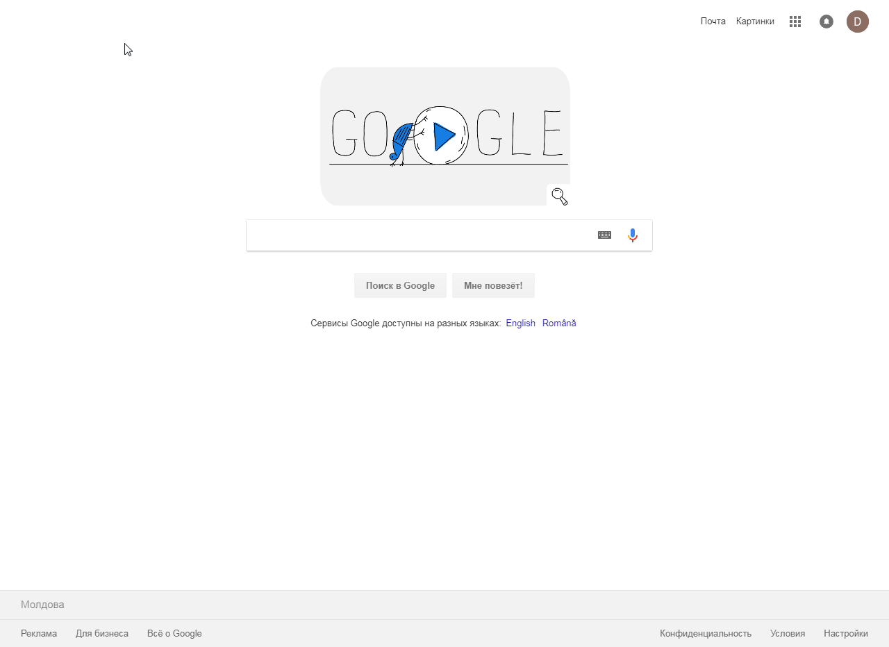

# [Навыки > ](../teach.md)Developer Tools(Инспектор)
Elements:

<details>
    <summary>
       Горячие клавиши:
    </summary>

* Откыть панель:
    ```
    CTRL+SHIFT+I или F12    - показать инструмент разработчика
    ```
    ```
    CTRL+SHIFT+J   - показать вкладку консоли
    ```
    ```
    CTRL+[, CTRL+]  - переключения между вкладками
    ```
    ```
    CTRL+SHIFT+C   - активировать визуальный поиск
    ```
    ```
    CTRL++, CTRL+-, CTRL+0  - маштабирование
    ```
Работа с html(DOM)
* Редактирование
    ```
    UP,DOWN,LEFT,RIGHT  - перемещение по иерархии
    ```
    ```
    DOUBLE_CLICK или ENTER  по атрибуту в HTML
        TAB или SHIFT+TAB - переход на следющий атрибут
    ```
    ```
    После установки курсора на числовое значение - UP и DOWN изменение параметра на 1
        SHIFT+UP или SHIFT+DOWN - изменение параметра на 10
        SHIFT+PageUp или SHIFT+PageDown - изменение параметра на 100
        ALT+UP или ALT+DOWN - изменение параметра на 0.1 
    ```
    ```
    H - сокрытие элемента
    ```
    ```
    DELETE  - удаление эл-ма из DOM
    ```
    ```
    Зажимаем лк мыши и перемещаем эл-т
    ```
    ```
    RIGHT_CLICK по элементу > Scroll into view  - прокрутка к выбранному эл-ту
    ```
    selectElement > RIGHT_CLICK > Force element state > :hover(или др.) - эмуляция наведения элемента
    
    F2  - редактирование HTML
        CTRL+ENTER  - применить изменения
        ESC - отменить изменения
    CTRL+Z  - отмена любого     действия
    CTRL+F  - поиск элементов
    
</details>

<details>
    <summary>
        Тесты на переполнения
    </summary>
    
* находим интересующий текстовый узел, делаем двойной клик по тексту и заполняем его 
* находим родителя потокового блока, переходим в режим редактирования(F2), вставляем еще несолько блоков и применяем изменения(CTRL+ENTER)
* в консоли вводим `document.body.contentEditable = true`. Теперь можно кликать в браузере по тексту и наполнять его
</details>

<details>
    <summary>
        Работа со стилями
    </summary>

```
в поле Filter - быстро найти правило или значение 
```
```
CTRL+CLICK на любом CSS правиле     - просмотреть любую строку с данным правилом
```
```
TAB - следуещее св-во или значение св-ва
SHIFT-TAB   - предыдущее св-во  или значение св-ва
```
```
После установки курсора на числовое значение - UP и DOWN изменение параметра на 1
SHIFT+UP или SHIFT+DOWN - изменение параметра на 10
SHIFT+PageUp или SHIFT+PageDown - изменение параметра на 100
ALT+UP или ALT+DOWN - изменение параметра на 0.1   
```
</details>
 
### Отладчик(debugger)
Брейкпоинт(точку останова) можно создать двумя способами

1)[ЕЕ можно поставить в самом коде или во вкладке Sources кликнув по номеру строки скрипта](./img/DevToolsCreateBreakpoint.gif)

2)debugger; //точка останова (вписав в код)

### Sources
 Breakpoints - все точки останова
 Scoupe - все переменные в текущей фун-ии
 Call Stack - как вы пришли к этой фун-ии
 Watch - можно писать любые выражения, которые выполнятся
 
 Resume/Pause script execution(F8) - возобнавление автоматического выполнения программы
 Step оver(F10) - переход к следующей инструкции
 Step in(F11) - переход в следующую фун-ю(внутрь фун-ии)
 Pause on exception - поставить breakpoints на ошибках(отлов ошибки)
   

<details>
    <summary>
        Включаем линейку в Developer Tools:
    </summary>
    
F12 > CTRL+SHIFT+M > Responsive > Edit > Settings > Preferences > Show rules

</details>
---
Полезные ссылки:
* [Официальная документация (на англ.)](https://developers.google.com/web/tools/chrome-devtools/)
* [Отладка в браузере Chrome](https://learn.javascript.ru/debugging-chrome)
* [Консоль разработчика Google Chrome: десять неочевидных полезностей](https://habr.com/company/ruvds/blog/316132/)
* []()