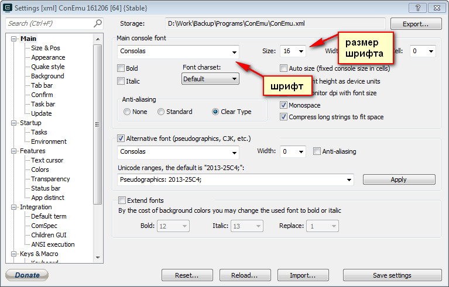
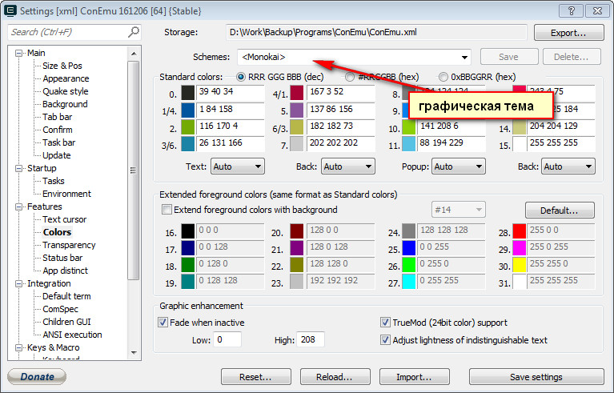
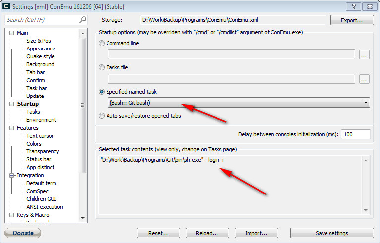
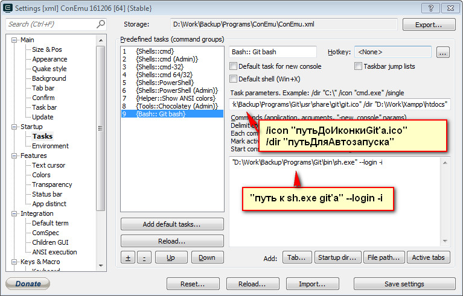

# [Навыки > ](../teach.md)Git
Надо понимать:
````
git fetch
git push
git stash
git log
branch
merge
rebase
git revert
````

### Настройки GIT'a
````
git config      //настройки git’a
        git config --global user.name “Vasilii Pupkin”
        git config --global user.email “some@mail.com”
        git config --global core.editor vim
````
настройки с параметром --global
````
git config --list       //просмотр состояния (имя, емайл)
git config --global core.quotepath off      //по умолчанию, git будет печатать не-ASCII символов в именах файлов в виде восьмеричных последовательностей \nnn. Что бы избежать нечитаемых строк, установите соответствующий флаг.
````
### Полезные команды (bash)
````
pwd     //показать рабочую директорию
````
````
cd      //изменить рабочую директорию
        cd ~desktop/...../../
        cd d:/work/xampp/htdocs/tutorial/
        cd ..          -подняться на один уровень  выше (директории)
        можно нажимать TAB что бы прописывать(автодополнение) путь 
        cd -        - верунуться в предыдущую дерикторию
````
`
start .     //показать директорию в проводнике
start d/Work/названиеФайла      //отрывает файл в программе которая назначена по умолчанию 
`
````
tree        //показать дерево папок
````
````
git названиекоманды --help      //вызов справки по команде
        git add --help
````
````
ls      //показать содержимое директории
        ls ~/Desktop        //показать содержимое директории не переходя в нее
        ls -1 d/Work        //показать содержимое директории списком
````    
````
mkdir       //создать директорию
        mkdir testfolder/www/src/{css,js} - p
        mkdir 
````
````
mv /названиепапкикоторуюперемещаем /путькудаперемещаемпапку     //перемещаем(переименовываем) папку
        mv test test3
        mv test/* test      //переместить все содержимое папки test
````
````
touch index.html        //создать файл
        touch index.html css/style.css
        touch index.html css/{main.css, buttons.css} js/{main.js,plugins.js}
````
````
rm -r       //удалить папку/файл
        rm -r *     //удалить содержимое папки(в которой уже находимся)
        rm -rf      //удалить содержимое папки без подтверждения(ОПАСНАЯ КОМАНДА)
        rm -f -i названиефайла.расширение       //удаление файла
````
````
gitk        //запуск визуализации истории коммитов
````
````
clear       //очистить терминал от записей/команд и т.д.
````
````
less        //показать содержимое файла
     less system.log        //выведет на экран часть информации из файла
                                             CTRL+F     прокрутка вниз
                                             CTRL+B     прокрутка вверх
                                             SHIFT+G     прокрутка в самый низ
                                             G     прокрутка в самый вверх
                                             Q  выход из режима просмотра(прокрутки)
````
### Удаление файлов
````
git rm названиефайлаилипапки        //удаляет файл из рабочего каталога(в след. раз он будет не отслеживаемый)
git rm -f названиепапкиилифайла     //удаляет файл/папку принудительно(использовать в крайних случаях)
git rm --cached названиефайлаилипапки       //удалить файл/папку из индекса
Example:    git rm log/\*.log       //удаляет все файлы которые имеют расширение .log в каталоге /log
            git rm \*~      //удаляет все файлы которые заканчиваются на ~                        
````
### Перемещение
````
git mv file_from file_to        //перемещение файлов
````
### Слежение за файлами(status)
````
git init        //инициализация git
git status      //просмотр состояния/действий над файлами
git add     //добавить файл для слежения
        git add (название папки/файла) 
        Example:      git add index.html        //добавит файл index.html(будет следить за ним)
        git add .       //добавить все папки/файлы
        git add *.html      //добавить файлы с расширением html
        git add --all       //добавить все файлы
````
### Игнорирование слежения за файлами
````
.gitignore      //файл, служит для того что бы исключить слежение за некоторыми файлами/папками
                                   можно указать     /названиепапки     для игнорирования каталога
                                   *.а          не следить за файлами с расширением      а
                                   !lib.a          но следить за файлом     lib.a     не смотря что мы игнорируем все файлы с расширением a
                                   /название файла         игнорирование только файла названиефайла находящийся в корневом каталоге
                                   названиепапки/          игнорирование всех файлов в каталоге названиепапки
                                   doc/*.txt          игнорировать doc/notes.txt, но не doc/server/arch.txt
                Example:
                                #Exclude Fonts
                                _fonts/
                                #Exclude Text and PSD file
                                *.txt
                                *.psd
               Example:
                              $cat .gitignore                             
                               *.[oa]                                   игнорирование любые файлы заканчивающиеся(с расширением) на .о или .а

                                *~                                         игнорировать все файлы заканчивающиеся ~

````          
### Коммит(commit)
```
git commit      //отправка коммита
        git commit –m 'тут сообщение'       //отправка коммита с сообщением(иногда работают только с двойными ковычками)
        git commit –am ‘тут сообщение’        //отправка в коммит всех изменений(т.е не надо использовать команду git add перед коммитом)
git commit --amned      //изменить последний коммит(если надо добавить файлов/изменить название коммита)
git commit --amend -m 'новое название'      //переименование последнего сделанного коммита
```
### Просмотр истории коммитов(log)
````
git log     //показать логи коммитов
git log - p названиефайла       //просмотреть изменения в файле
git log -p -2       //параметр -p     показывать разницу между внесенными каждыми коммитами, параметр  -2     ограничить вывод до 2х последних записей
git log --stat      //показывать статистику по каждому коммиту
git log --pretty=online     //параметр --pretty     изменить формат вывода лога,     =online     показывать коммит в одну строчку (в дополнение можно использовать комманды short, full, fuller     для вывода больше или меньше информации)
git log --pretty=format:/"%h - %an, %ar : %s"          параметр format позволяет создать свой собственный форма вывода лога
                                                                               
список полезных параметров формата:
                                   %H         хеш коммита
                                   %h          сокращенный хеш коммита
                                   %T          хеш дерева
                                   %t           сокращенный хеш дерева
                                   %P          хеши родительских коммитов
                                   %p          сокращенные хеши родительских коммитов
                                   %an        имя автора
                                   %ae        электронная почта автора
                                   %ad        дата автора(формат соответствует параметру -date=)
                                   %ar          дата автора относительная(пр. "2 мес. назад")
                                   %cn          имя коммитера
                                   %ce          электронная почта коммитера
                                   %cd          дата коммитера
                                   %cr          дата коммитера относительная
                                    %s          комментарий

-p                         выводит патч, закладку внесенную каждым коммитом
-stat                      выводит статистику по файлам изменененным в каждом коммите
--sortstat               отображает только одну сторку с changed/insertions/dimentions от вывода опцией -stat
--name-only          выводит список изменененых файлов после каждого коммита
--name-status        выводит список файлов вместе с информацией о добавлении/изменении/удалении
--abbrev-date
--graph
--pretty
````

### Отмена изменении
```
git commit --amend      //отмена изменений последнего коммита
git reset HEAD названиефайла        //отмена индексации файла(когда случайно добавил "git add." не нужные файлы)
git checkout --названиефайла        //отмена изменений файла(старый файл перезаписывается поверх нового"измененного" - использовать осторожно)

git log --since=2.weeks     //выдает список коммитов за последние 2 недели

git clone ссылкаизгитхаба       //клонирование репозитария из сети
git clone ссылкаизгитхаба названиепапки     //клонирование репозитария в новую папку
```
### Различия между файлами(diff)
```
git diff        //показать какие (именно) изменения были сделаны в файлах; красным подсвечивается - то что удалилили, зеленным - добавили
        git diff –staged
git diff названиефайла     //показать изменения в файле
git show ID     //показать изменения которые сделаны в определенном коммите; ID смотри по команде git log
git diff master..newfeature     //сравнение последних коммитов в ветке master и ветке newfeature

git blame названиефайла     //кто и когда редактировал файл 
```
### Ветки(branch)
```
git branch названиеветки        //создать ветку
git branch      //показать все существующие ветки
git branch -v       //посмотреть последний коммит на каждой из веток
git branch -d названиеветки     //удалить ветку
git branch --merged     //показать те ветки которые вы уже слили с текущей
git branch --no-merged      //показать те ветки которые вы еще не слили  в текущую ветку
```
#### Слияние(merged)
````
git checkout названиеветки      //переключение на другую ветку название
        git checkout master     //переключение на главную ветку
        git checkout -b  названиеветки      //переключение на новую ветку(только что созданную)
                               
git merge названиеветки        //скопировать/слить изменения из названиеветки в ту, в которой уже находишся

git log --graph --all --decoratе        //показать дерево всех коммитов из всех веток
git log --graph --all --decoratе --online       //показывать дерево для всех коммитов из всех веток в одну строку      
````

### Работа с удаленными репозитариями(pull / push)
````
git remote                    просмотр какие удаленные сервера уже настроены
git remote -v               просмотр какие удаленные сервера уже настроены более подробно
git remote add сокр.названиерепозитария     urlрепозитария               добавление/настройка удаленного репозитария

git push сокрназваниерепозитария названиеветки          отправляет репозитрарий(локальный) на удаленный сервер
          Example:
               git push remote master          оправка на север в репозитарий - remote, ветку - master 
          
git pull     забрать с удаленного сервера изменения себе на компьютер
````

Удаление репозитария, если удалим с сайта – то останется локальная версия repo, если удалим с клента repo – то останется repo (просто не будет отслеживаться изменения); только удалив файловым менеджером папку с репозитарием – можно избавиться от него

````
git chekout -- .      восстанавливаем файлы которые последний раз отправляли в коммит
git chekout --theirs -- _assets/наваниефайла.расширение
git add _assets/ наваниефайла.расширение
git commit -m ‘ название сообщения’
git merge названиеветки            - сливание веток
git push -u origin master              - отправка репозитария на удаленный сервер
````
Установка
    set PATH=C:\Program Files\Git\bin;%PATH%    //если есть проблемы с работой команды
---
<details>
    <summary>
        Настройки ConEmu для работы с git 
    </summary>
    
Если не отображает русский текст в git'е через ConEmu([Подробнее тут](https://isqua.ru/blog/2017/05/15/cmder-charset/)):

Startup > Environment >

`set LC_ALL=ru_RU.UTF-8
 set LANG=ru_RU.UTF-8`
 





/icon "D:\Work\Backup\Programs\Git\usr\share\git\git.ico" /dir "D:\Work\Xampp\htdocs"

"D:\Work\Backup\Programs\Git\bin\sh.exe" --login -i
</details>


---
Полезные ссылки:
* [Уроки Git от loftblog](https://www.youtube.com/watch?v=ttDK7nwoGnU&list=PLIcAMDxr6tpqJ3FHGVpYVn-puu6CJiOKh)
* [Скринкаст от Ильи Кантора](https://www.youtube.com/playlist?list=PLDyvV36pndZHkDRik6kKF6gSb0N0W995h)
* [Удачная модель ветвления для Git](https://habrahabr.ru/post/106912/)
* [Основы Git - Запись изменений в репозиторий](https://git-scm.com/book/ru/v1/%D0%9E%D1%81%D0%BD%D0%BE%D0%B2%D1%8B-Git-%D0%97%D0%B0%D0%BF%D0%B8%D1%81%D1%8C-%D0%B8%D0%B7%D0%BC%D0%B5%D0%BD%D0%B5%D0%BD%D0%B8%D0%B9-%D0%B2-%D1%80%D0%B5%D0%BF%D0%BE%D0%B7%D0%B8%D1%82%D0%BE%D1%80%D0%B8%D0%B9)
* [Git How To: курс обучения Git на русском](https://githowto.com/ru)
* [Настольная книга по Git](https://git-scm.com/book/ru/v2)
* [Коллекция часто задаваемых вопросов по Git с возможностью поиска](http://firstaidgit.ru/#/)
* [Как оформлять коммиты, чтобы потом не было больно](https://habrahabr.ru/company/Voximplant/blog/276695/)
* [Удачная модель ветвления для Git](https://habr.com/post/106912/)