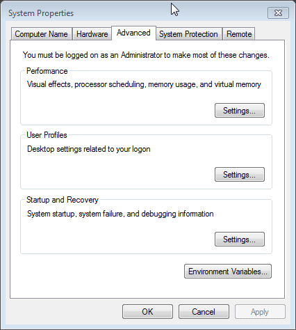

# [Навыки > ](../teach.md)Gulp

### Установка:
Для большинства проектов, gulp должен быть установлен глобально и локально. Если вы хотите использоваеть gulp только локально[(нужно будет его настроить)](https://youtu.be/xptUdO3GuG8?list=PLDyvV36pndZFLTE13V4qNWTZbeipNhCgQ)   
    `npm i gulpjs/gulp.git#4.0 -D` или точно такая же команда ``  //установка gulp 4 глобально
    `npm i gulpjs/gulp.git#4.0`     //установка gulp 4 локально
    `npm update gulp -g`    //для обновления модулей gulp
    `gulp -v`   //узнать версию установленного gulp
    `npm rm gulpjs/gulp.git#4.0` // удалить gulp(локально)
Если вы будете использовать gulp локально, нужно будет изменить системную переменную PATH. Для этого(из под Windows), нажимаем WIN+PAUSE(или Мой компьютер>Свойства) > Advanced system settings > Enviroment variables 

    
2. Перейдите через консоль в папку с проектом, и запустите команду(можно на все вопросы просто нажать ENTER): `npm init`
3. В файле *package.json*:
    `{
        "name": "template_for_work",
        "version": "1.0.0",
        "devDependencies": {
        }
    }
    "scripts": {
        "test": "echo \"Error: no test specified\" && exit 1",
        "gulp": "./node_modules/.bin/gulp"      //если вы пользуетесь gulp локально
      }`
4. В папке с проектом запустите команду:`npm install --save-dev gulp`
По [ссылке](http://gulpjs.com/plugins/) можно найти все необходимые плагины:

	1. Для установки введите в консоль команду с установкой, например(конкатинация файлов)`npm install --save-dev gulp-concat-css` или `npm i gulp-concat-css -D`
	2. создай файл *gulpfile.js* с кодом: 
       `const gulp = require('gulp');
        gulp.task('default', function() {
          // place code for your default task here
        });`
	3. На странице с плагином есть примерно такой код:  
       `const gulp = require('gulp');
        const concatCss = require('gulp-concat-css');
        gulp.task('default', function () {
          return gulp.src('assets/**/*.css')
            .pipe(concatCss("styles/bundle.css"))
            .pipe(gulp.dest('out/'));
        });`
	4. Необходимо скопировать нижний блок кода и вставить его в *gulpfile.js* что бы выглядело примерно вот так:
       `const gulp = require('gulp');
        const concatCss = require('gulp-concat-css');
        gulp.task('default', function() {
            gulp.src('css/**/*.css')  /*директория с которой будем работать*/
                .pipe(concatCss("bundle.css")) /*как файл будет называться*/
                .pipe(gulp.dest('css/'));   /*в какой директории файл будет сохраняться*/
        });`
	5. З

### Плагины(package.json):
    "gulp"
    "gulp-cli"      //
//LOCAL SERVER//    
    "browser-sync"  
    
//HTML//
    "gulp-pug"      //препроцессор html
    "gulp-htmlhint"     //валидация html
    "gulp-htmlmin"      //минификация html
    "wiredep"       //подключает библиотеки
    "gulp-google-cdn"       //заменяет ссылки библиотек(локальные) на google cdn

//CSS//
    "gulp-stylus"       //препроцессор css
    "gulp-minify-css"       //минификация css
    "gulp-autoprefixer"     //автоматически расставляет префиксы в css
    "gulp-sourcemaps"       //создает sourcemaps(для облегчения разработки)
    "gulp-uncss"        //удаление неиспользованного css(оптимизация)
    
//JS//
    "gulp-concat"       //конкатенация js
    "gulp-uglify"       //минификация js
    "gulp-eslint"       //проверка на наличие ошибок/качества кода   
    
//IMAGES//    
    "gulp-imagemin"     //сжатие и оптимизация изображений
    "gulp.spritesmith"  //автоматическая генерация спрайтов
    
//[OPTIMIZATION](https://www.youtube.com/watch?v=uYZPNrT-e-8&index=6&list=PLDyvV36pndZFLTE13V4qNWTZbeipNhCgQ)//

`return gulp.src('source/styles/main.styl', **{since: lastRun('styles')})**`      //при повторных запусках, обрабатываются только измененные файлы(использовать для одного файла в котором есть инклюды или импорты не рекомендую)

"gulp-newer"        //сравнивает файлы из src и dest, и не дает в поток файлы которые уже есть в dest(делает тоже самое что и `since: LastRun`, работает для первого запуска таска)    

"gulp-cached"       //считывет файлы с одинаковой датой/содержимым и во второй раз через себя не пропускает(работет медленее чем `since: gulp.lastRun`, так тут считывает только дата изменения)

"gulp-remember"     //запоминает все файлы которые проходят через него в внутреннем кэше(позволяет не обрабатывать все файлы записанные в таске)

"path"      //находит абсолютный путь к файлу

"gulp-main-bower-files"     //переопределяет/вытаскивает из скачанных bower библиотек файлы

"gulp-notify"       //показывает уведомления

//FILES//
    "gulp-rename"      //переименовывает файлы
    "del"      //удаляет файлы
         
    "gulp-plumber"
    "gulp-debug"        //показывает в консоли что - происходит в таске
    "through2"      //для написания собственных плагинов

---
Полезные ссылки:
* [Несколько полезностей по работе с NPM](https://habrahabr.ru/post/206678/)
* [Самые нужные плагины для Gulp](https://habrahabr.ru/post/252745/), [Приятная сборка frontend проекта](https://habrahabr.ru/post/250569/), [Мультипроектный gulp-файл](https://canonium.com/articles/gulp-multi-project), [Использование Gulp. Часть 1 - Установка.](https://simplamarket.com/blog/ispolzovanie-gulp-chast-1---ustanovka)
* [Grunt- и Gulp-таски для оптимизации производительности](https://frontender.info/performance-optimization/)
* [Скринкаст по Gulp от loftblog](https://www.youtube.com/playlist?list=PLY4rE9dstrJwXCz1utct9b6Vub9VWQoKo)
* [Скринкаст по Gulp от Ильи Кантора](https://www.youtube.com/playlist?list=PLDyvV36pndZFLTE13V4qNWTZbeipNhCgQ)