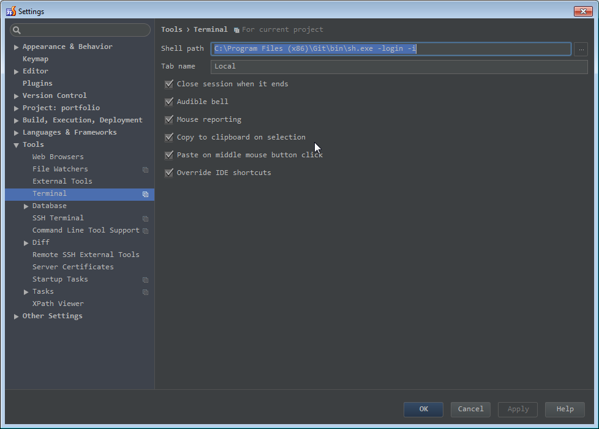
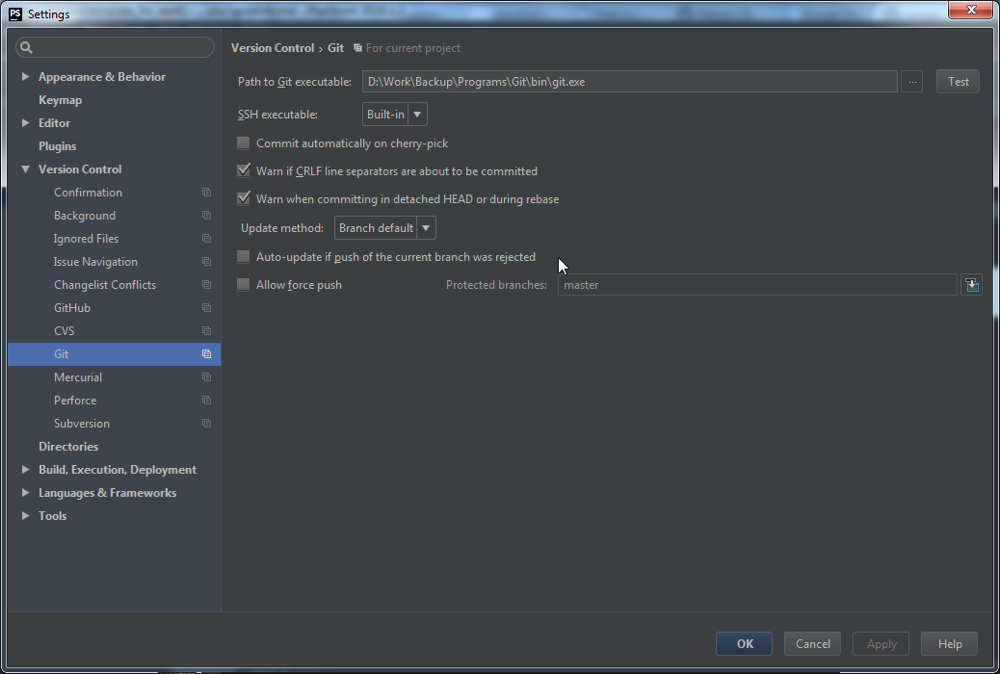
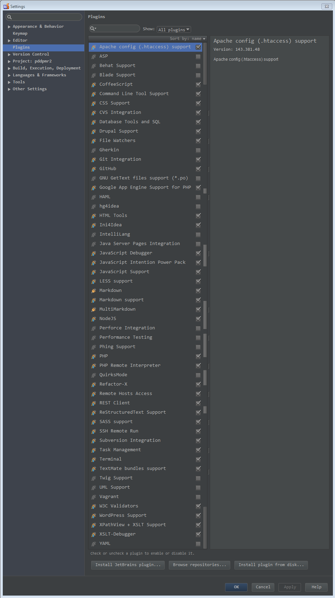
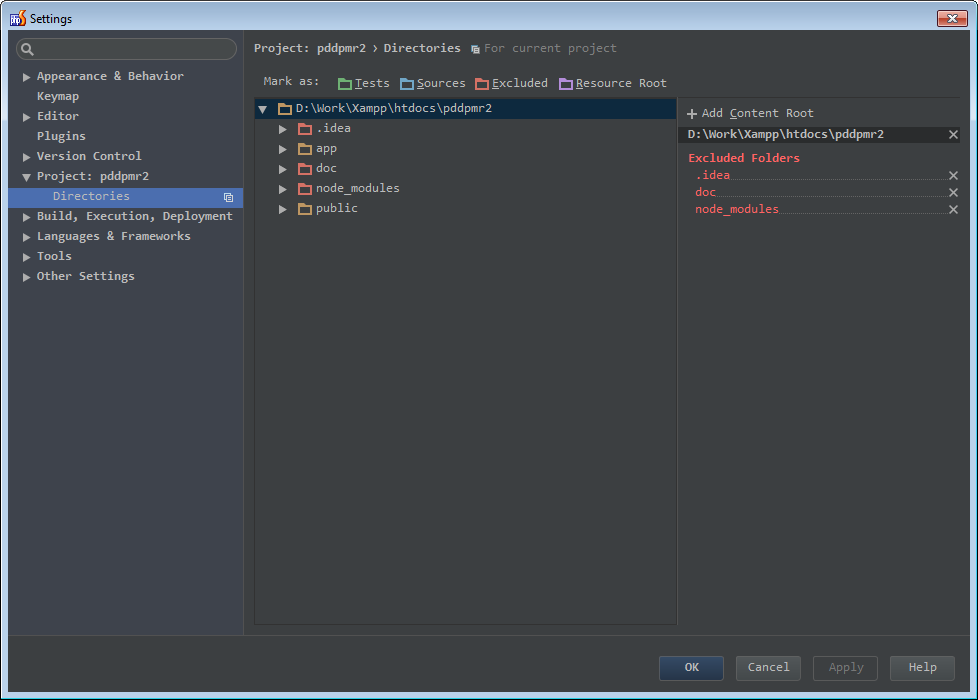

# [Навыки > ](../teach.md) PHPStrome

## Горячие клавиши:
**Вкладки:**

    CTRL+TAB     переключение по закладкам
    CTRL+E     переключение по последним файлам 
    CTRL+F4     закрыть вкладку
    ALT+CLICK(покрестику)   закрывает все остальные вкладки(кроме той по которой кликали)
    
    CTRL+SHIFT+A     быстрый поиск по командам *storm
    
    SHIFT+ALT+N     новая задача
    CTRL+SHIFT+F10     запуск страницы в браузере
     
    
    CTRL+SHIFT+V     буфер обмена *storm'a хранит несколько последних копий
    SHIFT+F6      переименовать файл

**Работа с текстом:**
    
* Комментирование:

    CTRL+SHIFT+/     многострочный коментарий
    CTRL+/     закоменитровать одну строку   

    CTRL+D     копирование с переносом на следующую строку 
    CTRL+SHIFT+V     просмотр журнала в котором можно просмотреть и вставить все скопированные фрагменты текста 
    CTRL+Y     очистить(удалить) строку
    CTRL+SHIFT+UP/DOWN     переместить строку вверх/вниз
    ALT+Click     многострочный курсор
    CTRL+W     выделяет слово/строку/документ
    CTRL+SHIFT+U     делает текст в верхнем/нижнем регистре
    ALT+J+Click     выделит все одинаковые слова
    
**Терминал**

    ALT+F12     открыть/закрыть терминал

## Настройки
Перенос строки:
    Settings(CTRL+ALT+S) > Editor > General > Soft Wraps > Use soft wraps in Edtor(checked)

Плагины:    
    Settings(CTRL+ALT+S) > Plugins:
        Get gist     (для работы с кусками кода)(после установки кликаем правой кнопкой мыши,)
        CodeGlance     (миникарта кода, для облегчения поиска)
        WebFont plugin (плагин для работы с шрифтами)(В меню)
        EditorConfig    (плагин для стандартизации синтаксиса, см. файл - .editorconfig; [для дополнительной информации и его настроек](http://editorconfig.org/)). Settings(CTRL+ALT+S) > CodeStyle > "Enable editorconfig" (checked)

Тема PHPStrom:
     Установка:     File > Import Settings > Выбираем файл с темой
    [Monokai Sublime Text 3](./files/Monokai%20Sublime%20Text%203.jar.zip)
    Тема SublimeText 
        File>Settings(CTRL+ALT+S) > Apperance (Dracula)> Editor > Colors & Fonts > Fonts > Sheme > Save as: My theme
                                                    Primary font: Consolas
                                                       size: 14

PHPStorm и WebStorm хранят темы в конфигурационной папке. Она находиться:

	* Windows

		* XP: C:\Documents and Settings\%username%\.WebIde10\config\colors
		* Vista/7: C:\Users\%username%\.WebIde10\config\colors
	* Mac: ~/Library/Preferences/WebIde10/colors
	* Linux: ~/.WebIde10/config/colors

    

        Терминал bash:
    

        
C:\Program Files (x86)\Git\bin\sh.exe -login -i

Настройка git'a:

Для запуска JS приложений вам нужно что бы в ОС был установлен Node.js и плагин в ***Strome, затем можно запускать программы с помощью CTRL+SHIFT+F10

    

        Ускоряем ***Strome:
    

    
Отключить не нужные плагины, File> Settings(CTRL+ALT+S) > Plugins:

Отключить индексацию не нужных папок в проекте, File > Settings(CTRL+ALT+S) > Directories 

Help > Edit Custom VM Options:
    #my customs options
    -Dawt.useSystemAAFontSettings=lcd
    -Dawt.java2d.opengl=true

Отключить автоматическое сканирование внешних изменений. Раздел «General» в настройках IDE. Нужно отключить опцию «Synchronize files on frame activation» — это позволит избавиться от «замираний» при переключении на окно IDE. При установленной опции Storm просматривает метаданные файлов проекта на предмет внесения внешних изменений и сканирует директории на наличие новых файлов. Это происходит каждый раз когда окно IDE получает фокус. Ясное дело, что операция затратная. При большом количестве файлов в проекте, утилизация процессора скачет под 100%, отсюда и «замирания». После отключения опции для ручного запуска сканирования можно пользоваться кнопкой «Refresh» (следующая после «Save»).

## Глюк с переключением языковой раскладки:
    Нужно будет указать для переключения на английский язык - особое сочетание клавиш
    Settings > AdvancedKeySettings > Выбираем английский язык > Change Key Sequence > Указываем необходимые сочетания клавиш
    
---
Полезные ссылки:
* [Скринкаст PHPStorm](https://www.youtube.com/playlist?list=PLY4rE9dstrJzAnXFt9m48Q0V5_2kVK1Qt)
* [Be Awesome in PHPStorm](https://laracasts.com/series/how-to-be-awesome-in-phpstorm)