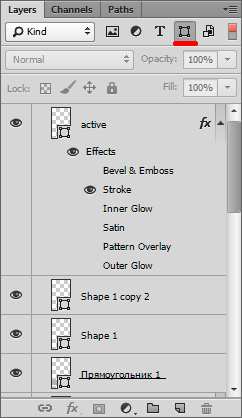
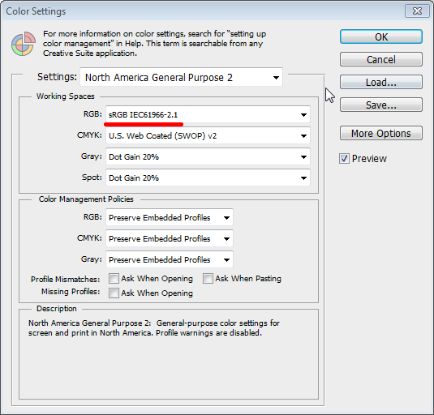
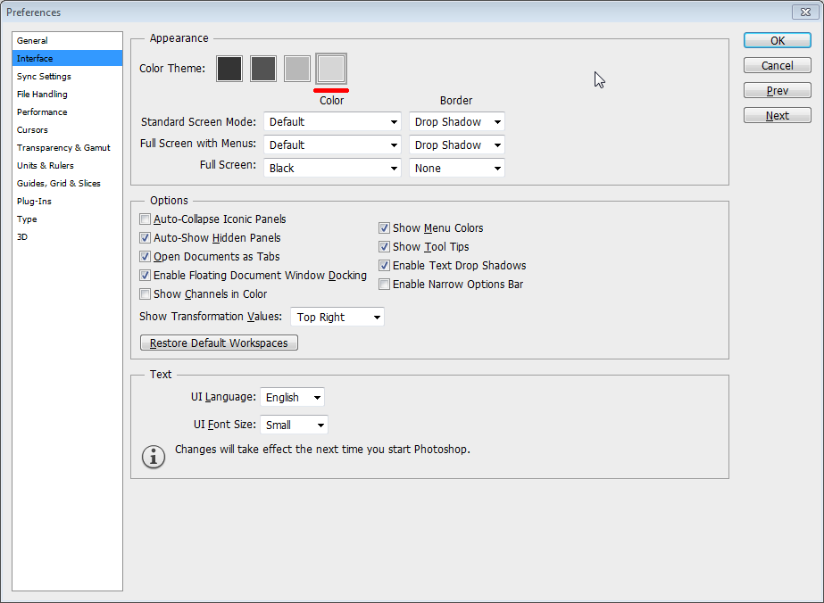
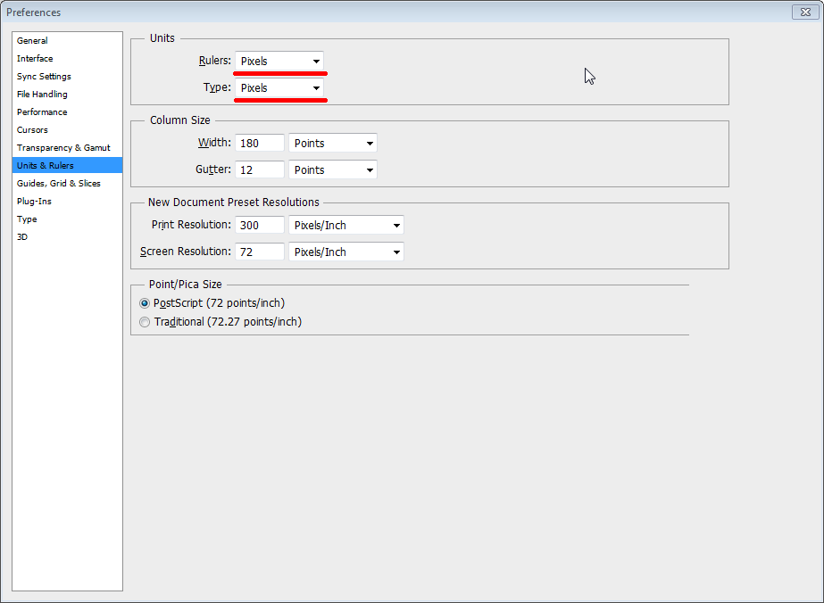

# [Навыки > ](../teach.md)Photoshop
Найти ответы:

 Оптимизация картинок под retina
 Градиент, как его найти
 
### Советы:
1. Отфильтровав слои по тексту, можно узнать если в макете шрифты которые не установлены в вашей системе
2. * Для иконок с прозрачным фоном используйте формат PNG24;

   * для анимации - GIF; 
   
   * для всего остального, нет прозрачности(контента,) JPEG. [Так же для jpeg используйте прогрессивное сжатие](./img/PhotoshopSaveJpegProgresive.jpg) [Потому что.](https://yuiblog.com/blog/2008/12/05/imageopt-4/)

3. Для оформительские картинки сохраняем в папку img, images, i
 Контентные изображения сохраняем в папку pic, pict,pictures
4. Рекомендуемое именование оформительских изображений. Пишем имена без пробелов, символы, только латиница, минус или подчеркивание.
Имя делим на части с помощью минуса или подчеркивания. 
Приставка обозначает для чего картинка - icon(для иконок)
    bg(для фононовых изображений)
    form(для графической стилизации форм)
    button(для изображений кнопок)
    sprite(для картинок спрайтов) 
Корень - суть картинки, или область ее применения
    form-radio.png      // для названия радио кнопки
    form-radio-checked.png  // название нажатой радио кнопки
 
#Как вырезать иконки?
* Правым кликом по слою иконки Dublicate Layer (в новый документ) 
* В меню выбираем Image>Trim(Transparent Pixels)
* CTRL+SHIFT+ALT+S  Сохраняем картинку в нужном формате 
* Предпочительнее было б для этого всего создать макрос ALT+F (Actions)

Для фоновых текстур:
1. Способ. Применим для повторяющихся картинок:
    * Сольем все слои Layer > Flatten Image 
    * Увеличим маштаб
    * Выберем инструмент Crop Tool (C) 
    * Выберем фрагмент который повторяется и нажмем ENTER
    * Экспортируем
2. Способ. Применим если была использованна заливка с помощью структры
    * Выберем слой на котором находится структура с помощью инструмент Move Tool(V) Auto Select
    * Делаем двойной клик по миниатюре слоя, сохраняем структуру в свой PHTSHP, New Pattern
    Создаем новый документ с размерами нашей новой структуры, вставляем и сохраняем Layer > New Fill Layer > Pattern
    
3. Способ. 
    Выделяем квадратную область размером  от 50-100px по стороне и сохраняем созданную структуру.
###Горячие клавиши:

Маштабирование:

    CTRL+1     маштабировать до 100%
    CTRL+0     маштабировать на весь экран
Инструменты:

    CTRL+R     линейка
Показ/Скрытие вспомогательных элементов:

    CTRL+;     скрытие сетки
    ALT+левый клик по слою     скрывает все слои кроме того по которому кликнули(второй клик - вернет все в прежнее положение)

Cохранение:

    CTRL+ALT+SHIFT+S     сохранение картинки для веб'a 
    F12     возврат к последнему сохранению на диск(откат)
Режимы окна:
    
    F       измененния режима показа окна   
    SHIFT+F      полноэкранный режим
### Ускорение верстки
* [CSS Hat](./files/csshat.zip)
    Для установки запустите csshat.exe , дальше запускаем PS должен появиться наш плагин(Window > Extensions > CSS Hat)
    Для работы CTRL + ALT + RIGHT_CLICK
* [CSS3Ps](./files/CSS3Ps.zip)
    Извлекаем все файлы из архива "C:\Program Files\Adobe\Adobe Photoshop CC(64 Bit)\Plug-ins\Panels\CSS3Ps"
    Для работы просто перетаскиваем элемент в блок с плагином
### Размер отступов для текстовых элементов:
Изначально нужно высчитать расстояние между строками, но просто измерить расстояние между строками нельзя(нужно еще учитывать высоту строки, а не только высоту шрифта)   

`(Высота строки - Высота шрифта)/2
    затем вычитаем из общей ширины между элементами полученное`
  
  !Высота строки не должна быть меньше высоты шрифта, иначе при переносе строки буквы будут "слипаться".
TODO: настроить ESLINT
Показать только векторные объекты:

    

        **Настройки Photoshop**
    

Настройки цвета:
Edit > Color Settings (SHIFT+CTRL+K)

Настройка интерфейса
Edit > Preferences > General (CTRL+K) : рекомендуется светлый фон

Настройка линеек и шрифтов: установим единицы px

